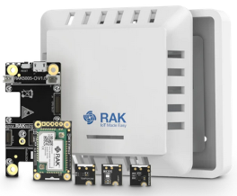

# WisBlock Sensor Solution for LoRaWAN
|  |  |  |    
| :-: | :-: | :-: |     

# Content
- [Hardware supported](#hardware_supported)
- [Software used](#software_used)
- [How to use it](#how_to_use_it)
- [Packet data format](#packet_data_format)
- [Setup Weather Kits](#setup-weather)
- [Setup GNSS Kits](#setup-gnss)
- [Setup Air Quality Kits](#setup-air-quality)

This is a new approach for WisBlock. It scans the I2C bus and Serial to detect which WisBlock modules are attached to the WisBlock base and creates an LoRaWAN payload in Cayenne LPP with the data of the found modules. 
### _REMARK_     
This firmware is using the [WisBlock API](https://github.com/beegee-tokyo/WisBlock-API) ⤴️ which helps to create low power consumption application and taking the load to handle communications from your shoulder. 

This code can be used without changes for    
| Kit/Solution | Setup Guide |
| --           | --          |
| [WisBlock Kit 1](https://store.rakwireless.com/collections/kits-bundles/products/wisblock-kit-1-weather-monitor) ⤴️  | [Setup Kit 1](#setup_weather) |
| [WisBlock Kit 2](https://store.rakwireless.com/collections/kits-bundles/products/wisblock-kit-2-lora-based-gps-tracker-with-solar-panel) ⤴️ | [Setup Kit 2](#setup_gnss) |
| [WisBlock Kit 3](https://store.rakwireless.com/collections/kits-bundles/products/wisblock-kit-3-gps-tracker) ⤴️ | [Setup Kit 3](#setup_gnss) |
| [WisBlock Kit 4](https://store.rakwireless.com/collections/kits-bundles/products/wisblock-kit-4-air-quality-monitor) ⤴️ | [Setup Kit 4](#setup_air_quality) |
| [RAK Developer Kit](https://store.rakwireless.com/collections/kits-bundles/products/lpwan-gateway-developer-kit) ⤴️ | [Setup Dev Kit 2](#setup_weather)   [Setup Dev Kit 3](#setup_gnss)   [Setup Dev Kit 4](#setup_air_quality) |
| [Helium Mapper Kit](https://store.rakwireless.com/collections/kits-bundles/products/helium-mapper-kit) ⤴️ | [Setup Helium Mapper](#setup_gnss) |
| [WisBlock GNSS Tracker for LoRaWAN](https://store.rakwireless.com/collections/wisblock-solutions/products/rak10700-gnss-tracker-for-lorawan) ⤴️ | [Setup GNSS Tracker](#setup_gnss) |

----

# Hardware supported
| Module | Function | Used in Kit |
| --     | --       | --          |
| [RAK4631](https://docs.rakwireless.com/Product-Categories/WisBlock/RAK4631/Overview/) ⤴️ | WisBlock Core module | - |
| [RAK5005-O](https://docs.rakwireless.com/Product-Categories/WisBlock/RAK5005-O/Overview/) ⤴️ | WisBlock Base board | - |
| [RAK19007](https://docs.rakwireless.com/Product-Categories/WisBlock/RAK19007/Overview/) ⤴️ | WisBlock Base board | - |
| [RAK19003](https://docs.rakwireless.com/Product-Categories/WisBlock/RAK19003/Overview/) ⤴️ | WisBlock Mini Base board | - |
| [RAK19001](https://docs.rakwireless.com/Product-Categories/WisBlock/RAK19001/Overview/) ⤴️ | WisBlock Fullsize Base board | - |
| [RAK1901](https://docs.rakwireless.com/Product-Categories/WisBlock/RAK1901/Overview/) ⤴️ | WisBlock Temperature and Humidty Sensor | WisBlock Kit 1, RAK Developer Kit 2 |
| [RAK1902](https://docs.rakwireless.com/Product-Categories/WisBlock/RAK1902/Overview/) ⤴️ | WisBlock Barometer Pressure Sensor | WisBlock Kit 1, RAK Developer Kit 2 |
| [RAK1903](https://docs.rakwireless.com/Product-Categories/WisBlock/RAK1903/Overview/) ⤴️ | WisBlock Ambient Light Sensor | WisBlock Kit 1, RAK Developer Kit 2 |
| [RAK1904](https://docs.rakwireless.com/Product-Categories/WisBlock/RAK1904/Overview/) ⤴️ | WisBlock Acceleration Sensor (used for GNSS solutions) | WisBlock Kit 2 & 3, WisBlock Tracker for LoRaWAN, RAK Developer Kit 3 |
| [RAK1905](https://docs.rakwireless.com/Product-Categories/WisBlock/RAK1905/Overview/) ⤴️ | WisBlock 9 DOF sensor | - |
| [RAK1906](https://docs.rakwireless.com/Product-Categories/WisBlock/RAK1906/Overview/) ⤴️ | WisBlock Environment Sensor | WisBlock Kit 4, RAK Developer Kit 4 |
| [RAK1910](https://docs.rakwireless.com/Product-Categories/WisBlock/RAK1910/Overview/) ⤴️ | WisBlock GNSS Sensor | WisBlock Kit 2 & 3, RAK Developer Kit 3|
| [RAK1921](https://docs.rakwireless.com/Product-Categories/WisBlock/RAK1921/Overview/) ⤴️ | WisBlock OLED display | (Status display)|
| [RAK5814](https://docs.rakwireless.com/Product-Categories/WisBlock/RAK5814/Overview/) ⤴️ | WisBlock ACC608 encryption module | - |
| [RAK12002](https://docs.rakwireless.com/Product-Categories/WisBlock/RAK12002/Overview/) ⤴️ | WisBlock RTC module | - |
| [RAK12003](https://docs.rakwireless.com/Product-Categories/WisBlock/RAK12003/Overview/) ⤴️ | WisBlock FIR sensor | - |
| [RAK12004](https://docs.rakwireless.com/Product-Categories/WisBlock/RAK12004/Overview/) ⤴️ | WisBlock MQ2 Gas sensor | - |
| [RAK12008](https://docs.rakwireless.com/Product-Categories/WisBlock/RAK12008/Overview/) ⤴️ | WisBlock MG812 CO2 Gas sensor | - |
| [RAK12009](https://docs.rakwireless.com/Product-Categories/WisBlock/RAK12009/Overview/) ⤴️ | WisBlock MQ3 Alcohol Gas sensor | - |
| [RAK12010](https://docs.rakwireless.com/Product-Categories/WisBlock/RAK12010/Overview/) ⤴️ | WisBlock Ambient Light sensor | - |
| [RAK12014](https://docs.rakwireless.com/Product-Categories/WisBlock/RAK12014/Overview/) ⤴️ | WisBlock Laser ToF sensor | - |
| [RAK12019](https://docs.rakwireless.com/Product-Categories/WisBlock/RAK12019/Overview/) ⤴️ | WisBlock UV Light sensor | - |
| [RAK12025](https://docs.rakwireless.com/Product-Categories/WisBlock/RAK12025/Overview/) ⤴️ | WisBlock Gyroscope sensor | - |
| [RAK12023/RAK12035](https://docs.rakwireless.com/Product-Categories/WisBlock/RAK12023/Overview/) ⤴️ | WisBlock Soil Moisture and Temperature sensor | WisBlock Soil Sensor Solution |
| [RAK12027](https://docs.rakwireless.com/Product-Categories/WisBlock/RAK12027/Overview/) ⤴️ | WisBlock Earthquake Sensor | - |
| [RAK12032](https://docs.rakwireless.com/Product-Categories/WisBlock/RAK12032/Overview/) ⤴️ | WisBlock Acceleration Sensor | - |
| [RAK12034](https://docs.rakwireless.com/Product-Categories/WisBlock/RAK12034/Overview/) ⤴️ | WisBlock 9 DOF sensor | - |
| [RAK12037](https://docs.rakwireless.com/Product-Categories/WisBlock/RAK12037/Overview/) ⤴️ | WisBlock CO2 sensor | - |
| [RAK12039](https://docs.rakwireless.com/Product-Categories/WisBlock/RAK12039/Overview/) ⤴️ | WisBlock Particle Matter sensor | - |
| [RAK12040](https://docs.rakwireless.com/Product-Categories/WisBlock/RAK12040/Overview/) ⤴️ | WisBlock AMG8833 temperature array sensor | - |
| [RAK12047](https://docs.rakwireless.com/Product-Categories/WisBlock/RAK12047/Overview/) ⤴️ | WisBlock VOC sensor | - |
| [RAK12500](https://docs.rakwireless.com/Product-Categories/WisBlock/RAK12500/Overview/) ⤴️ | WisBlock GNSS Sensor | WisBlock Tracker for LoRaWAN |
| [RAK14002](https://docs.rakwireless.com/Product-Categories/WisBlock/RAK14002/Overview/) ⤴️ | WisBlock 3 button touch pad | - |
| [RAK14003](https://docs.rakwireless.com/Product-Categories/WisBlock/RAK14003/Overview/) ⤴️ | WisBlock LED bar display | - |
| [RAK14008](https://docs.rakwireless.com/Product-Categories/WisBlock/RAK14008/Overview/) ⤴️ | WisBlock Gesture sensor | - |
| [RAK15000](https://docs.rakwireless.com/Product-Categories/WisBlock/RAK15000/Overview/) ⤴️ | WisBlock EEPROM module | - |
| [RAK15001](https://docs.rakwireless.com/Product-Categories/WisBlock/RAK15001/Overview/) ⤴️ | WisBlock Flash module | - |
| [RAK14008](https://docs.rakwireless.com/Product-Categories/WisBlock/RAK14008/Overview/) ⤴️ | WisBlock Gesture sensor | - |
| [RAK16000](https://docs.rakwireless.com/Product-Categories/WisBlock/RAK16000/Overview/) ⤴️ | WisBlock DC current sensor | - |

## _LIMITATIONS_     
- The RAK1904 module _**MUST**_ be installed in     
    - Slot C of RAK5005-O, RAK19007 or RAK19001
    - Slot A of RAK19003
- The RAK1905 module _**MUST**_ be installed in     
    - Slot C of RAK5005-O, RAK19007 or RAK19001
    - Slot A of RAK19003
- RAK1910 and RAK12500 cannot be used together (both are GNSS location trackers)

## Power consumption
The MCU and LoRa transceiver go into sleep mode between measurement cycles to save power. I could measure a sleep current of 40uA of the whole system for a solution that enables sleep. Some solutions, like GNSS trackers or the RAK12047 VOC sensor, that require longer wake times or more frequent wake-ups, have a higher power consumption.    
In addition, sensors like the MQ gas sensors that are using a heating element will consume more power as well.

----

# Software used
## IDE
- [PlatformIO](https://platformio.org/install) ⤴️
- alternative [ArduinoIDE](https://www.arduino.cc/en/software) ⤴️
- [Adafruit nRF52 BSP](https://docs.platformio.org/en/latest/boards/nordicnrf52/adafruit_feather_nrf52832.html) ⤴️
- [Raspberry Pi RP2040 BSP](https://docs.platformio.org/en/latest/platforms/raspberrypi.html) ⤴️
- [Patch to use RAK4631 & RAK11310 with PlatformIO](https://github.com/RAKWireless/WisBlock/tree/master/PlatformIO) ⤴️
## LoRaWAN and BLE communication
- [WisBlock-API](https://registry.platformio.org/libraries/beegee-tokyo/WisBlock-API) ⤴️
- [SX126x-Arduino LoRaWAN library](https://registry.platformio.org/libraries/beegee-tokyo/SX126x-Arduino) ⤴️
- [CayenneLPP](https://registry.platformio.org/libraries/sabas1080/CayenneLPP) ⤴️
- [ArduinoJson](https://registry.platformio.org/libraries/bblanchon/ArduinoJson) ⤴️
## Sensor libraries
- [Adafruit BME680 Library](https://registry.platformio.org/libraries/adafruit/Adafruit%20BME680%20Library) ⤴️
- [Adafruit LIS3DH](https://registry.platformio.org/libraries/adafruit/Adafruit%20LIS3DH) ⤴️
- [Adafruit LPS2X](https://registry.platformio.org/libraries/adafruit/Adafruit%20LPS2X) ⤴️
- [Adafruit MCP23017 Arduino Library](https://registry.platformio.org/libraries/adafruit/Adafruit%20MCP23017%20Arduino%20Library) ⤴️
- [Adafruit Unified Sensor](https://registry.platformio.org/libraries/adafruit/Adafruit%20Unified%20Sensor) ⤴️
- [ClosedCube OPT3001](https://github.com/beegee-tokyo/ClosedCube_OPT3001_Arduino) ⤴️
- [Coulomb Counter](https://registry.platformio.org/libraries/seeed-studio/Grove%20-%20Coulomb%20Counter%20for%203.3V%20to%205V%20LTC2941) ⤴️
- [INA219_WE](https://registry.platformio.org/libraries/wollewald/INA219_WE) ⤴️
- [Melopero RV3028](https://registry.platformio.org/libraries/melopero/Melopero%20RV3028) ⤴️
- [nRF52_OLED](https://registry.platformio.org/libraries/beegee-tokyo/nRF52_OLED) ⤴️
- [Pololu VL53L0X](https://registry.platformio.org/libraries/pololu/VL53L0X) ⤴️
- [RAK12019_LTR390_UV_Light](https://registry.platformio.org/libraries/beegee-tokyo/RAK12019_LTR390_UV_Light) ⤴️
- [RAK12035_SoilMoisture](https://registry.platformio.org/libraries/beegee-tokyo/RAK12035_SoilMoisture) ⤴️
- [RAKwireless CAP1293 Touch Pad library](https://registry.platformio.org/libraries/beegee-tokyo/Arduino%20CAP1293%20Touch%20Pad%20library) ⤴️
- [RAK I3G4250D Gyroscope](https://registry.platformio.org/libraries/beegee-tokyo/RAK%20I3G4250D%20Gyroscope) ⤴️
- [RAKwireless MQx library](https://registry.platformio.org/libraries/rakwireless/RAKwireless%20MQx%20library) ⤴️
- [RAKwireless VEML Light Sensor](https://registry.platformio.org/libraries/rakwireless/RAKwireless%20VEML%20Light%20Sensor) ⤴️
- [RevEng PAJ7620](https://registry.platformio.org/libraries/acrandal/RevEng%20PAJ7620) ⤴️
- [Sensirion Core](https://registry.platformio.org/libraries/sensirion/Sensirion%20Core) ⤴️
- [Sensirion Gas Index Algorithm](https://registry.platformio.org/libraries/sensirion/Sensirion%20Gas%20Index%20Algorithm) ⤴️
- [Sensirion I2C SGP40](https://registry.platformio.org/libraries/sensirion/Sensirion%20I2C%20SGP40) ⤴️
- [SparkFun SHTC3 Humidity and Temperature Sensor Library](https://registry.platformio.org/libraries/sparkfun/SparkFun%20SHTC3%20Humidity%20and%20Temperature%20Sensor%20Library) ⤴️
- [SparkFun u-blox GNSS Arduino Library](https://registry.platformio.org/libraries/sparkfun/SparkFun%20u-blox%20GNSS%20Arduino%20Library) ⤴️
- [TinyGPSPlus](https://registry.platformio.org/libraries/mikalhart/TinyGPSPlus) ⤴️
- [LPS35HW](https://registry.platformio.org/libraries/pilotak/LPS35HW) ⤴️
- [SparkFun SCD30 Arduino Library](https://registry.platformio.org/libraries/sparkfun/SparkFun%20SCD30%20Arduino%20Library) ⤴️
- [SparkFun MLX90632 Noncontact Infrared Temperature Sensor](https://registry.platformio.org/libraries/sparkfun/SparkFun%20MLX90632%20Noncontact%20Infrared%20Temperature%20Sensor) ⤴️
- [Melopero AMG8833](https://registry.platformio.org/libraries/melopero/Melopero%20AMG8833) ⤴️
- [SparkFun ADXL313 Arduino Library](https://registry.platformio.org/libraries/sparkfun/SparkFun%20ADXL313%20Arduino%20Library) ⤴️
- [RAKwireless Storage](https://registry.platformio.org/libraries/beegee-tokyo/RAKwireless%20Storage) ⤴️
- [ArduinoECCX08](https://registry.platformio.org/libraries/arduino-libraries/ArduinoECCX08) ⤴️
- [Adafruit FRAM I2C](https://registry.platformio.org/libraries/adafruit/Adafruit%20FRAM%20I2C) ⤴️

... to be updated, check platformio.ini for a list of all libraries used

### _REMARK_     
The project was developed using Platform IO. But for the users that _**still**_ stick to Arduino IDE, an Arduino IDE compatible copy of the sources is in the ArduinoIDE folder.    
The complete project for PIO is in the PlatformIO folder.    

### _REMARK_
When using PlatformIO, the libraries are all listed in the **`platformio.ini`** and are automatically installed when the project is compiled.     
When using Arduino IDE all libraries need to be installed manually using the Arduino Library Manager.

----

# How to use it
Compile the firmware and flash it on a WisBlock with all required modules installed.

## Setup the LPWAN credentials with one of the options:

### Over USB

Connect over USB to setup the LPWAN credentials. Use the DevEUI printed on the RAK4631, use the AppEUI and AppKey from your LPWAN server. Do NOT activate automatic join yet. As weather sensor levels are not changing very fast, it might be sufficient to set the send frequency to every 10 minutes. The send frequency is set in seconds, so the value would be  10 * 60 ==> 600

**Example AT commands:**
```AT
AT+NWM=1
AT+NJM=1
AT+BAND=10
AT+DEVEUI=1000000000000001
AT+APPEUI=AB00AB00AB00AB00
AT+APPKEY=AB00AB00AB00AB00AB00AB00AB00AB00
AT+SENDFREQ=600
```

| Command | Explanation | 
| --- | --- | 
| AT+NWM=1 | set the node into LoRaWAN mode |
| AT+NJM=1 | set network join method to OTAA |
| AT+BAND=10 | set LPWAN region (here AS923-3) see [AT Command Manual](https://github.com/beegee-tokyo/WisBlock-API/blob/main/AT-Commands.md#atband) ⤴️ for all regions |
| AT+DEVEUI=1000000000000001 | set the device EUI, best to use the DevEUI that is printed on the label of your WisBlock Core module |
| AT+APPEUI=AB00AB00AB00AB00 | set the application EUI, required on the LoRaWAN server |
| | AT+APPKEY=AB00AB00AB00AB00AB00AB00AB00AB00 | set the application Key, used to encrypt the data packet during network join |
AT+SENDFREQ=600 | set the frequency the sensor node will send data packets. 600 == 10 x 60 seconds == 10minutes |

### _REMARK_
The manual for all AT commands can be found here: [AT-Commands.md](https://github.com/beegee-tokyo/WisBlock-API/blob/main/AT-Commands.md) ⤴️

### Over BLE
Use the [WisBlock Toolbox](https://play.google.com/store/apps/details?id=tk.giesecke.wisblock_toolbox) ⤴️, connect over Bluetooth with the Soil Sensor and setup the credentials. Do NOT activate automatic join yet.

----

# Packet data format
The packet data is made compatible with the extended Cayenne LPP encoding from [ElectronicCats/CayenneLPP](https://github.com/ElectronicCats/CayenneLPP) ⤴️.    
The content of the packet depends on the modules installed on the WisBlock Base Board:     

| Data                     | Channel # | Channel ID | Length   | Comment                                           | Required Module   | Decoded Field Name |
| --                       | --        | --         | --       | --                                                | --                | --                 |
| Battery value            | 1         | _**116**_  | 2 bytes  | 0.01 V Unsigned MSB                               | RAK4631           | voltage_1          |
| Humidity                 | 2         | 104        | 1 bytes  | in %RH                                            | RAK1901           | humidity_2         |
| Temperature              | 3         | 103        | 2 bytes  | in °C                                             | RAK1901           | temperature_3      | 
| Barometric Pressure      | 4         | 115        | 2 bytes  | in hPa (mBar)                                     | RAK1902           | barometer_4        |
| Illuminance              | 5         | 101        | 2 bytes  | 1 lux unsigned                                    | RAK1903           | illuminance_5      |
| Humidity 2               | 6         | 104        | 1 bytes  | in %RH                                            | RAK1906           | humidity_6         |
| Temperature 2            | 7         | 103        | 2 bytes  | in °C                                             | RAK1906           | temperature_7      | 
| Barometric Pressure 2    | 8         | 115        | 2 bytes  | in hPa (mBar)                                     | RAK1906           | barometer_8        |
| Gas Resistance 2         | 9         | 2          | 2 bytes  | 0.01 signed (kOhm)                                | RAK1906           | analog_9           |
| GNSS stand. resolution   | 10        | 136        | 9 bytes  | 3 byte lon/lat 0.0001 °, 3 bytes alt 0.01 meter   | RAK1910, RAK12500 | gps_10             |
| GNSS enhanced resolution | 10        | _**137**_  | 11 bytes | 4 byte lon/lat 0.000001 °, 3 bytes alt 0.01 meter | RAK1910, RAK12500 | gps_10             |
| Soil Temperature         | 11        | 103        | 2 bytes  | in °C                                             | RAK12023/RAK12035 | temperature_11     |
| Soil Humidity            | 12        | 104        | 1 bytes  | in %RH                                            | RAK12023/RAK12035 | humidity_12        |
| Soil Humidity Raw        | 13        | 2          | 2 bytes  | 0.01 signed                                       | RAK12023/RAK12035 | analog_in_13       |
| Soil Data Valid          | 14        | 102        | 1 bytes  | bool                                              | RAK12023/RAK12035 | presence_14        |
| Illuminance 2            | 15        | 101        | 2 bytes  | 1 lux unsigned                                    | RAK12010          | illuminance_15     |
| VOC                      | 16        | _**138**_  | 2 bytes  | VOC index                                         | RAK12047          | voc_16             |
| MQ2 Gas                  | 17        | 2          | 2 bytes  | 0.01 signed                                       | RAK12004          | analog_in_17       |
| MQ2 Gas Percentage       | 18        | _**120**_  | 1 bytes  | 1-100% unsigned                                   | RAK12004          | percentage_18      |
| MG812 Gas                | 19        | 2          | 2 bytes  | 0.01 signed                                       | RAK12008          | analog_in_19       |
| MG812 Gas Percentage     | 20        | _**120**_  | 1 bytes  | 1-100% unsigned                                   | RAK12008          | percentage_20      |
| MQ3 Alcohol Gas          | 21        | 2          | 2 bytes  | 0.01 signed                                       | RAK12009          | analog_in_21       |
| MQ3 Alcohol Gas Perc.    | 22        | _**120**_  | 1 bytes  | 1-100% unsigned                                   | RAK12009          | percentage_22      |
| ToF distance             | 23        | 2          | 2 bytes  | 0.01 signed                                       | RAK12014          | analog_in_23       |
| ToF Data Valid           | 24        | 102        | 1 bytes  | bool                                              | RAK12014          | presence_24        |
| Gyro triggered           | 25        | _**134**_  | 6 bytes  | 2 bytes per axis, 0.01 °/s                        | RAK12025          | gyrometer_25       |
| Gesture detected         | 26        | 0          | 1 byte   | 1 byte with id of gesture                         | RAK14008          | digital_in_26      |
| LTR390 UVI value         | 27        | 2          | 2 byte   | 0.01 signed                                       | RAK12019          | analog_in_27       | 
| LTR390 UVS value         | 28        | 101        | 2 bytes  | 1 lux unsigned                                    | RAK12019          | illuminance_28     | 
| INA219 Current           | 29        | 2          | 2 byte   | 0.01 signed                                       | RAK16000          | analog_29          | 
| INA219 Voltage           | 30        | 2          | 2 byte   | 0.01 signed                                       | RAK16000          | analog_30          | 
| INA219 Power             | 31        | 2          | 2 byte   | 0.01 signed                                       | RAK16000          | analog_31          | 
| Touchpad left            | 32        | 102        | 1 bytes  | bool                                              | RAK14002          | presence_32        | 
| Touchpad middle          | 33        | 102        | 1 bytes  | bool                                              | RAK14002          | presence_33        | 
| Touchpad right           | 34        | 102        | 1 bytes  | bool                                              | RAK14002          | presence_34        | 
| SCD30 CO2 concentration  | 35        | 125        | 2 bytes  | 1 ppm unsigned                                    | RAK12037          |  concentration_35 |
| SCD30 temperature        | 36        | 103        | 2 bytes  | in °C                                             | RAK12037          | temperature_36 |
| SCD30 humidity           | 37        | 104        | 1 bytes  | in %RH                                            | RAK12037          | humidity_37 |
| MLX90632 sensor temp     | 38        | 103        | 2 bytes  | in °C                                             | RAK12003          | temperature_38 |
| MLX90632 object temp     | 39        | 103        | 2 bytes  | in °C                                             | RAK12003          | temperature_39 |
| PM 1.0 value             | 40        | 103        | 2 bytes  | in ug/m3                                            | RAK12003          | voc_40             |
| PM 2.5 value             | 40        | 103        | 2 bytes  | in ug/m3                                            | RAK12003          | voc_41             |
| PM 10 value             | 40        | 103        | 2 bytes  | in ug/m3                                            | RAK12003          | voc_42             |
### _REMARK_
Channel ID's in cursive are extended format and not supported by standard Cayenne LPP data decoders.

Example decoders for TTN, Chirpstack, Helium and Datacake can be found in the folder [decoders](./decoders) ⤴️

----

# Compiled output
The compiled files are located in the [./Generated](./Generated) folder. Each successful compiled version is named as      
**`WisBlock_SENS_Vx.y.z_YYYY.MM.dd.hh.mm.ss`**    
x.y.z is the version number. The version number is setup in the [./platformio.ini](./platformio.ini) file.    
YYYY.MM.dd.hh.mm.ss is the timestamp of the compilation.

The generated **`.zip`** file can be used as well to update the device over BLE using either [WisBlock Toolbox](https://play.google.com/store/apps/details?id=tk.giesecke.wisblock_toolbox) ⤴️ or [Nordic nRF Toolbox](https://play.google.com/store/apps/details?id=no.nordicsemi.android.nrftoolbox) ⤴️ or [nRF Connect](https://play.google.com/store/apps/details?id=no.nordicsemi.android.mcp) ⤴️

----

# Debug options 
Debug output can be controlled by defines in the **`platformio.ini`**    
_**LIB_DEBUG**_ controls debug output of the SX126x-Arduino LoRaWAN library
 - 0 -> No debug outpuy
 - 1 -> Library debug output (not recommended, can have influence on timing)    

_**API_DEBUG**_ controls debug output of the WisBlock-API library
 - 0 -> No debug outpuy
 - 1 -> Library debug output

_**MY_DEBUG**_ controls debug output of the application itself
 - 0 -> No debug outpuy
 - 1 -> Application debug output

_**CFG_DEBUG**_ controls the debug output of the nRF52 BSP. It is recommended to keep it off

## Example for no debug output and maximum power savings:

```ini
[env:wiscore_rak4631]
platform = nordicnrf52
board = wiscore_rak4631
framework = arduino
build_flags = 
	; -DCFG_DEBUG=2
	-DSW_VERSION_1=1 ; major version increase on API change / not backwards compatible
	-DSW_VERSION_2=0 ; minor version increase on API change / backward compatible
	-DSW_VERSION_3=0 ; patch version increase on bugfix, no affect on API
	-DLIB_DEBUG=0    ; 0 Disable LoRaWAN debug output
	-DAPI_DEBUG=0    ; 0 Disable WisBlock API debug output
	-DMY_DEBUG=0     ; 0 Disable application debug output
	-DNO_BLE_LED=1   ; 1 Disable blue LED as BLE notificator
lib_deps = 
	beegee-tokyo/SX126x-Arduino
	beegee-tokyo/WisBlock-API
	sparkfun/SparkFun SHTC3 Humidity and Temperature Sensor Library
	adafruit/Adafruit LPS2X
	closedcube/ClosedCube OPT3001
	sabas1080/CayenneLPP
extra_scripts = pre:rename.py
```

----

# Setup Weather
This guide can be used for **WisBlock Kit 1** and **RAK Developer Kit 2**

## Used Hardware
- WisBlock Core RAK4631
- WisBlock Base RAK5005-O, RAK19007 or RAK19001
- RAK1901
- RAK1902
- RAK1903

## Installing the modules
Install the modules in any matching slot, following the Quick Start Guides in the [RAKwireless Documentation Center](https://docs.rakwireless.com/)

## Firmware setup
Setup the device using the [AT command interface](#over-usb) or the [BLE application](#over-ble)

----

# Setup GNSS
This guide can be used for **WisBlock Kit 2**, **WisBlock Kit 3**, **WisBlock GNSS Tracker for LoRaWAN** and **RAK Developer Kit 3**

## Used Hardware
- WisBlock Core RAK4631
- WisBlock Base RAK5005-O, RAK19007, RAK19003 or RAK19001
- RAK1910 or RAK12500
- RAK1904 
- RAK1906

## Installing the modules
The RAK1904 module _**MUST**_ be installed in     
Slot C of RAK5005-O, RAK19007, RAK19003 or RAK19001

If using the RAK1910, it _**MUST**_ be installed in      
Slot A of RAK5005-O        
any matching slot of RAK19007 or RAK19001

If using the RAK12500, it can be installed in any matching slot of the Base Boards.

The RAK1906 can be installed in any matching slot of the Base Board.

For installation guides, following the Quick Start Guides in the [RAKwireless Documentation Center](https://docs.rakwireless.com/)

## Firmware setup
Setup the device using the [AT command interface](#over-usb) or the [BLE application](#over-ble)

RAK11700 GNSS Tracker for LoRaWAN is the default start mode for this setup.     
If building the Helium Mapper Kit, the mode _**MUST**_ be changed with the below AT command:

The solution can be set to 3 different working modes using the AT command **`AT+GNSS`**:

| Command                      | Input Parameter | Return Value                                                  | Return Code            |
| ---------------------------- | --------------- | ------------------------------------------------------------- | ---------------------- |
| AT+GNSS?                    | -               | `Get/Set the GNSS precision and format 0 = 4 digit, 1 = 6 digit, 2 = Helium Mapper` | `OK`                     |
| AT+GNSS=?                   | -               | `0` or `1` or `2`                                                     | `OK`                     |
| AT+GNSS=`<Input Parameter>` | `1` or `2` or `3`       | -                                                             | `OK` *or* `AT_PARAM_ERROR` |

### Using standard Cayenne LPP location resolution
The Cayenne LPP standard format uses only 4 digit for the location precision. This default location format is automatically supported by most LoRaWAN servers and Visualization platforms like **`MyDevices`**.     
It is the default and is set with the AT command **`AT+GNSS=0`**.

### Using improved location resolution
Setting this option, the data is still sent in Cayenne LPP format, but uses a custom data identifier and 6 digits for a higher latitude and longitude resolution. To decode this format a custom data encoder is required. Data encoders for TTN, Chirpstack and Datacake can be found in the [Custom Data Decoder](./decoders) folder.    
The enhanced location resolution is set with the AT command **`AT+GNSS=1`**.

### Using the Helium Mapper data format.
This option sends the data in the Helium Mapper format, as explained in [Make a Helium Mapper with the WisBlock](https://news.rakwireless.com/make-a-helium-mapper-with-the-wisblock/).     
Packet decoders for this format are provided in the above article.    
The Helium Mapper functionality is set with the AT command **`AT+GNSS=2`**.

----

# Setup Air Quality
This guide can be used for **WisBlock Kit 4** and **RAK Developer Kit 4**

## Used Hardware
- WisBlock Core RAK4631
- WisBlock Base RAK5005-O, RAK19007, RAK19003 or RAK19001
- RAK1906

## Installing the modules
Install the modules in any matching slot, following the Quick Start Guides in the [RAKwireless Documentation Center](https://docs.rakwireless.com/)

## Firmware setup
Setup the device using the [AT command interface](#over-usb) or the [BLE application](#over-ble)

